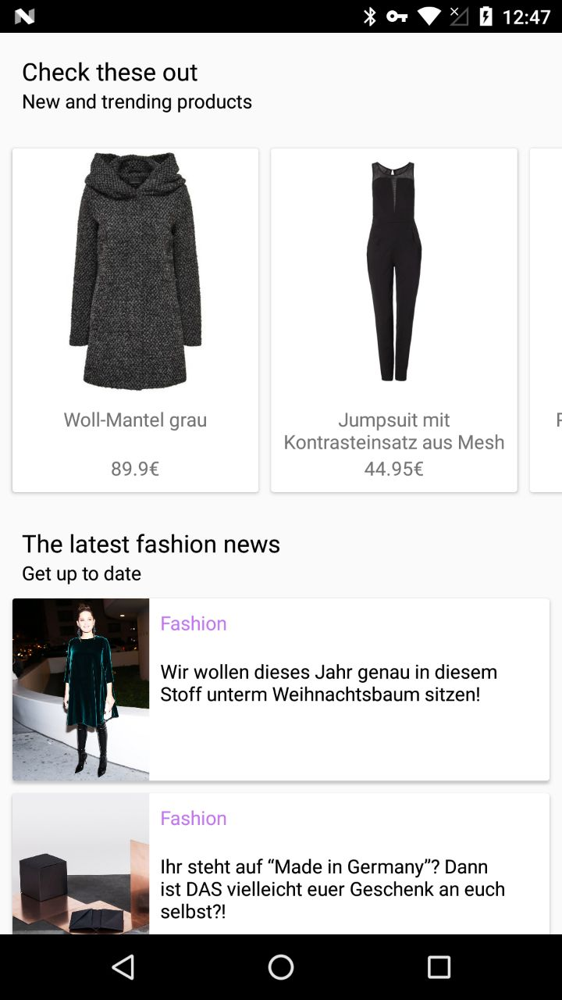
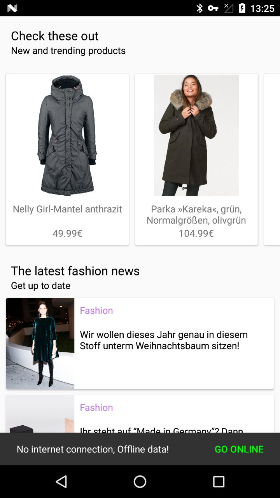
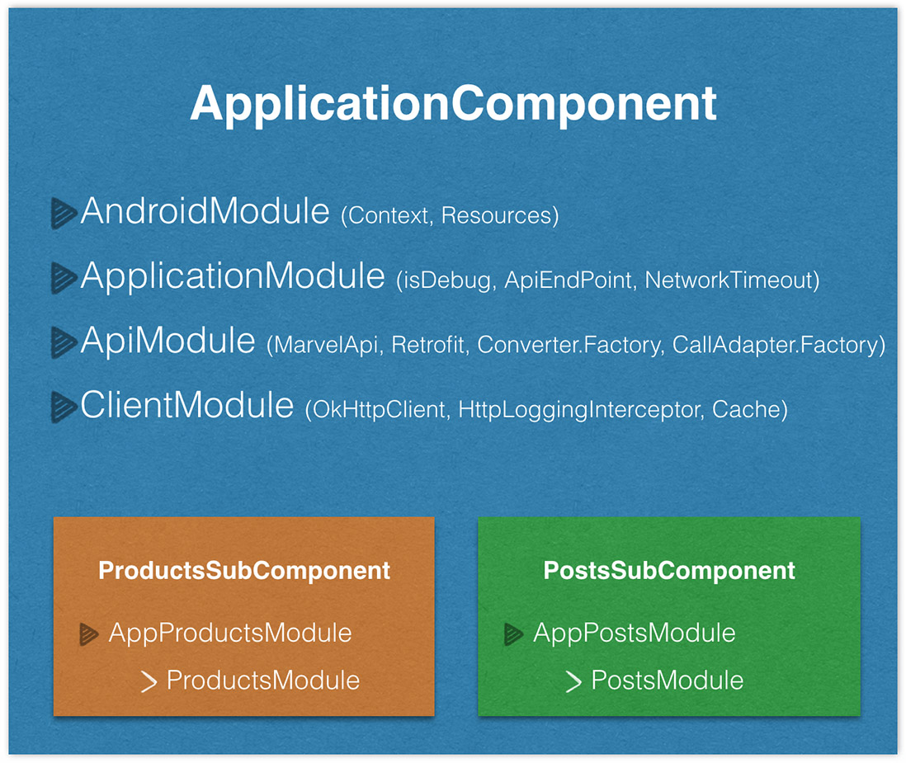

Stylight Application  
====================

This repository holds the source code of the Stylight Application, a simple Android application which can read products and posts from http://api.stylight.com and present them.
This application was created by [Mohsen Mirhoseini Argi](http://mirhoseini.com), as part of the technical assessment by the [Stylight](http://stylight.com) team.

--------------------
### What is this repository for? ###

* Stylight Application
*       Version:  1.0
* Last Update: Sat Dec 3, 2016

--------------------
### Development Tools ###

* Android Studio v2.2.2
* gradle-plugin v2.2.2
* Android SDK Build Tools v25.0.1
* MinSdkVersion 9
* CompileSDKVersion 25
* Retrolambda v3.3.1

--------------------
### Dependencies ###

* Android Support Tools (support, appcompat, recyclerView, vector) v25.0.1
* Retrofit v2.1.0
* Okhttp v3.4.1
* Dagger v2.4
* RxJava v1.1.9
* RxAndroid v1.2.1
* Butterknife v8.0.1
* AndroidUtils v1.0.7
* jUnit v4.12
* Android Support Test v0.5
* Mockito v1.10.19
* Robolectric v3.1.1
* Espresso v2.2.2

--------------------
### Important Notes ###

The application has one Activity, MainActivity. The MainActivity is consist of four Fragments, two ProductsFragments and two PostsFragments, which are responsible for presenting products and posts records according to their category.

All activity lifecycle and network behaviours are implemented, and according to device size and network situation user get a good UI and UX. If no internet connection or network error, a Snackbar pops up and ask user to turn on network connection or retry.

Some Test Cases was designed to test application UI functionality and core java classes using jUnit and AndroidUnitTest.

### Application Structure ###

The Application implemented and structured bases on the MVP pattern best practice, contributed by [Antonio Leiva](http://antonioleiva.com/mvp-android/).

Whole application functionality is implemented in "core-lib" module using pure Java, and the "app" module contain all codes required for Android Application to load on Android OS, which can be replace by any other interface (e.g. a console app or a web app)

The **view** (MainActivity/ProductsFragment/PostsFragment), contains it's own presenter and implement View interface and the only thing that the view will do is calling a method from the presenter every time there is an UI action.

The **presenter** (ProductsPresenter/PostsPresenter), is responsible to act as the middle man between view and model. It retrieve data (Products/Posts) from the Model and return it formatted to the view. It also decides what happens when user interact with the view.

The **models** (ProductsInteractor/PostsInteractor), would only be the gateway to the service domain layer (or business logic). In this case it provide the data needed to be displayed in the view from Network.

The networking and API call are managed by [Retrofit](http://square.github.io/retrofit/) and OkHttp as its httpclient, contributed by [Square](http://square.github.io). It also shows decent logs when application is running in Debug mode. 

Layers communications are managed by [RxJava](https://github.com/ReactiveX/RxJava) & [RxAndroid](https://github.com/ReactiveX/RxAndroid) contributed by [ReactiveX](http://reactivex.io).

Dependency Injections (DI) are being managed by [Dagger](https://github.com/google/dagger) created by [Square](http://square.github.io) and now maintained by [Google](http://google.github.io/dagger/).

Some minor Android common functions are managed using [AndroidUtils](https://github.com/mmirhoseini/android_utils) library, developed and published on jCenter by [myself](http://mirhoseini.com).

Whole projects Dependencies are placed in "libraries.gradle" to avoid version conflicts and redundant between "app" and "core-lib" modules.

Used new DataBinding library contributed by Google in Adapters for faster development.

Used new SupportVector library in some icons cases for a better UI.

Sample test cases are implemented by a mixture of Mockito, Espresso, Robolectric and mocking Dagger.

Finally, used [circleci](https://circleci.com/gh/mmirhoseini/stylight) and [travis ci](https://travis-ci.org/mmirhoseini/stylight) as Continues Integration (CI) services which are bind with project [Github](https://github.com/mmirhoseini/stylight) repo.